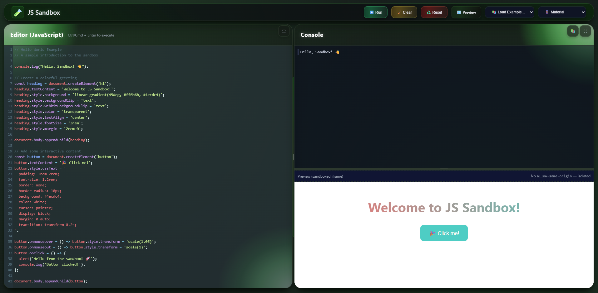

# JS Sandbox

A modular JavaScript sandbox for testing and experimenting with code in a safe, isolated environment. Built with vanilla ES6 modules and designed for maintainability.

This project was vibe-coded from a monolithic [codepen.io](https://codepen.io/guinetik/pen/XJXXegw) demo into a proper modular architecture.



## Features

- **Sandboxed execution**: JavaScript runs in an isolated iframe with no same-origin access
- **Syntax validation**: Catches syntax errors before execution using Function constructor
- **Real-time console**: Captures console.log, info, warn, error with proper styling
- **Code persistence**: Automatically saves code to localStorage
- **CodeMirror integration**: Optional enhanced editor with syntax highlighting
- **Examples system**: Dropdown loader with built-in code examples
- **Live preview**: Toggle iframe preview for DOM manipulation examples
- **Resizable panes**: Drag to resize editor/console horizontally and console/preview vertically
- **Timeout protection**: Configurable execution timeout to prevent infinite loops
- **Event system**: External communication for integration with other tools

## Architecture

```
src/
├── core/                  # Core functionality
│   ├── sandbox.js         # Iframe execution engine
│   ├── console.js         # Console output handler
│   ├── template.js        # HTML template engine
│   ├── storage.js         # LocalStorage persistence
│   ├── logger.js          # Debug logging
│   ├── events.js          # Event emitter
│   └── examples.js        # Examples loader
├── editors/               # Editor adapters
│   ├── base.js           # Base editor interface
│   ├── codemirror.js     # CodeMirror adapter
│   └── textarea.js       # Fallback textarea adapter
├── ui/                   # User interface
│   ├── controller.js     # Main app controller
│   ├── examples-dropdown.js  # Examples UI component
│   └── styles.css        # Application styles
└── index.js              # Entry point
```

## Usage

```html
<!DOCTYPE html>
<html>
<head>
  <!-- Optional: CodeMirror -->
  <link rel="stylesheet" href="https://cdnjs.cloudflare.com/ajax/libs/codemirror/5.65.16/codemirror.min.css">
  <script src="https://cdnjs.cloudflare.com/ajax/libs/codemirror/5.65.16/codemirror.min.js"></script>

  <link rel="stylesheet" href="src/ui/styles.css">
</head>
<body>
  <div class="app">
    <!-- Panes structure -->
  </div>
  <script type="module" src="src/index.js"></script>
</body>
</html>
```

### Programmatic API

```javascript
import { SandboxController } from './src/ui/controller.js';

const sandbox = new SandboxController({
  timeLimit: 5000,
  debug: true,
  defaultCode: 'console.log("Hello world");'
});

// Listen to events
sandbox.on('code:execute:complete', () => {
  console.log('Code finished executing');
});

// Control the sandbox
sandbox.setCode('alert("test")');
sandbox.run();
```

## Examples

The sandbox includes built-in examples demonstrating various features:

- **Hello World**: Basic DOM manipulation with interactive button
- **CSS Animations**: Spinning box with controls and rainbow colors
- **Interactive Form**: Form validation and submission handling
- **Canvas Drawing**: Mouse/touch drawing on HTML5 canvas

Examples are loaded from the `examples/` directory and automatically discovered at runtime.

## Technical Details

### Sandbox Isolation

Code executes in an iframe without `allow-same-origin`, providing true isolation from the parent page. Communication happens via postMessage for console output and status updates.

### Editor System

Pluggable editor architecture supports multiple editors:
- CodeMirror (when available)
- Fallback textarea (always available)

### Error Handling

- Syntax errors caught via Function constructor before execution
- Runtime errors captured via iframe error handlers
- Promise rejections handled and displayed
- Timeout protection prevents runaway code

### State Management

- Code persistence via localStorage
- Resizable pane positions maintained during session
- Preview state synchronized with UI controls

## Browser Support

Modern browsers with ES6 module support. No build tools required.

## Development

This was live-coded as a refactoring exercise, transforming a single 500+ line HTML file into a maintainable modular codebase. The focus was on:

- Clean separation of concerns
- Reusable components
- Comprehensive documentation
- Event-driven architecture
- Extensible design patterns

Built by Guinetik in collaboration with Claude (Anthropic).